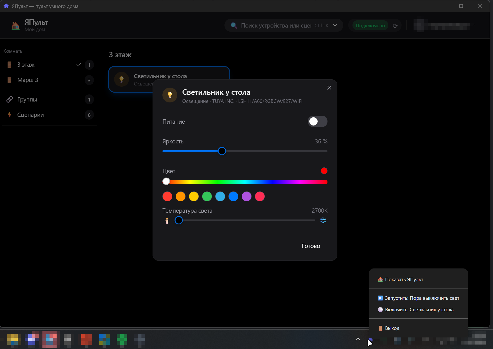

> Лампочка стоит в метре от меня. Я за компьютером. Телефон — где-то в другом месте. Зачем вообще два устройства, если можно управлять из того, за которым и так сижу.

---

## 🎯 Проблема

У меня умный дом на экосистеме Яндекса — розетки, лампочки, датчики, всё как положено. Официально управляется всё это через приложение «Дом с Алисой» на телефоне. Работает нормально, но по факту весь день я провожу за компьютером, а телефон в это время — отдельный гаджет, который нужно специально доставать, разблокировать и держать в руках только ради тумблера.

Получается странное дублирование: у меня уже есть экран перед глазами и клавиатура под рукой, но чтобы выключить свет на столе, нужно переключиться на другое устройство. Это не про лень — это про то, что управление домом логично иметь там же, где ты и так работаешь, а не размазывать по трём разным гаджетам.

Официального desktop-клиента у Яндекса нет. Web-версии тоже. Только мобильное приложение. Значит, будем делать своё — чтобы всё управление умным домом жило в одном месте, вместе с остальными рабочими инструментами на ПК.

---

## 🤖 Что такое вайб-кодинг в данном случае

Я не стал писать приложение руками от начала до конца — весь код в основном сгенерирован [Claude Code](https://www.anthropic.com/claude-code), я выступал скорее в роли архитектора и ревьюера: описывал задачи, проверял результат, просил переделать то, что не устраивало. Классический вайб-кодинг — быстро, но без построчного ручного ревью каждого файла.

Результат — рабочее приложение **[ЯПульт](https://github.com/BazZziliuS/ya-pult)**, которое я использую и еще несколько знакомых. Исходники открыты, так что можно посмотреть, что получилось.

---

## 🧱 Что получилось

**ЯПульт** — это desktop-приложение для Windows и Linux, по сути аналог «Дома с Алисой», но на рабочем столе. Никакого реверс-инжиниринга протоколов устройств или обхода API — всё работает через официальный REST API Яндекса (`api.iot.yandex.net/v1.0`).

Стек:

- **Electron** + **TypeScript** — во всех процессах (main, preload, renderer)
- **electron-vite** — сборка и hot reload
- **React** + **HeroUI** (на Tailwind CSS) — интерфейс
- **electron-builder** — сборка `.exe` под Windows и `.AppImage` под Linux

### Что умеет

- Вход через тот же Яндекс ID, что и в мобильном приложении
- Боковое меню с комнатами, группами, датчиками и сценариями — не одна длинная лента, а структура
- Плитки устройств: тумблеры, слайдеры яркости/громкости, температура света с быстрыми кнопками, выбор цвета через Hue-слайдер и сохранённые сцены
- Показания датчиков (температура, влажность, батарея) отдельной категорией
- Быстрый поиск по `Ctrl+K` — вбиваешь пару букв, находишь устройство, жмёшь Enter
- **Системный трей** — то, ради чего всё затевалось. Окно сворачивается в трей, а по правому клику на иконку открывается список последних 5 переключений с тумблерами прямо в меню — не нужно даже открывать окно
- Несколько домов (household), если они есть на аккаунте
- Проверка обновлений при старте через GitHub Releases
- RU/EN интерфейс, нативные OS-уведомления об ошибках сессии и разрыве связи

На скриншоте выше как раз видно, как это выглядит: клик по плитке лампочки открывает карточку с тумблером питания, слайдером яркости, Hue-цветом с пресетами и температурой света — а в углу видно то самое трей-меню с быстрым переключением без открытия основного окна.

В итоге сценарий «выключить свет» теперь выглядит так: правый клик по иконке в трее → клик по лампочке в списке последних действий. Два клика вместо похода за телефоном.

---

## 🔧 Интересные детали реализации

То, что обычно всплывает только когда реально пишешь интеграцию с чужим API, а не читаешь его документацию по диагонали.

### OAuth без сервера

Яндекс использует **implicit flow** (без `client_secret`). Поскольку у приложения нет своего backend, токен приходится перехватывать прямо из событий навигации Electron-окна авторизации — сервер для приёма редиректа не поднимается. Приложению нужен собственный зарегистрированный OAuth-клиент на `oauth.yandex.ru` с правами `iot:view` и `iot:control` — свой API-ключ Яндекс, разумеется, не даёт.

### Токен хранится только в зашифрованном виде

Через `safeStorage` из Electron. Если `safeStorage` недоступен в системе — приложение просто просит войти заново при следующем запуске, никакого fallback на хранение в открытом виде.

### API не всегда делает то, что написано в документации

Пара вещей, которые не совпадают с доками:

- Групповые действия реально уходят на `/groups/{id}/actions`, хотя официальная документация путает эндпоинт
- `action_result.status` приходит в верхнем регистре (`"DONE"` / `"ERROR"`) — сравнение пришлось делать регистронезависимым
- Порядок capabilities (умений устройства) между опросами не гарантирован — без сортировки по фиксированному приоритету контролы в интерфейсе банально «прыгали» местами при каждом обновлении

### Optimistic UI для слайдеров

Когда двигаешь яркость или цвет — интерфейс обновляется мгновенно, а реальная команда на устройство улетает в фоне (Яндекс всё равно ждёт ответ от навыка не дольше 3 секунд). За это отвечает хук `useOptimisticValue`: локальное значение живёт отдельно от того, что приходит через поллинг, а коммиты помечаются токенами поколений (generation tokens).

На разработке в этой логике была гонка: устаревшее значение из поллинга могло затереть свежий optimistic-коммит, и слайдер визуально «отскакивал» назад к старому значению прямо во время перетаскивания. Это чистая логика состояния без DOM и таймингов — достаточно было прогнать через хук последовательность `commit` → `setValue` (поллинг) → `rollback` и сравнить итоговое значение с ожидаемым, поэтому баг поймали юнит-тестом, а не тыканием слайдера руками.

### Ошибки между процессами Electron

Electron не переносит произвольные поля `Error` через границу IPC между main и renderer — долетает только `message`. Решение — кодировать структуру ошибки (`kind`, `httpStatus`) прямо в текст сообщения как JSON, чтобы интерфейс мог надёжно отличить «нет токена» от «нет сети» от «устройство не ответило».

---

## 🧪 Тесты и CI

Вопреки стереотипу про вайб-кодинг «наговнокодил и в прод» — в проекте есть Vitest-тесты без поднятия самого Electron: парсинг версий для авто-апдейта, валидация токена, кодирование/декодирование IPC-ошибок, сортировка capabilities, конвертация HSV↔hex для цветового слайдера, и тот самый `useOptimisticValue`.

Релизы собираются автоматически через GitHub Actions при пуше тега `v1.2.3` — на выходе `.exe` и `.AppImage`.

---

## 💡 Итого

Иногда самая полезная автоматизация — не сложный пайплайн и не self-hosted сервис, а маленькое desktop-приложение, которое объединяет управление умным домом с остальными рабочими инструментами на одном экране. Вайб-кодинг с Claude Code отлично подходит для таких точечных pet-проектов: понятная задача, ограниченный скоуп, можно быстро дойти до рабочего результата, не проседая по качеству там, где это важно (тесты на самые хрупкие места остались).

Исходники, инструкция по регистрации своего OAuth-приложения и сборке — в репозитории: **[github.com/BazZziliuS/ya-pult](https://github.com/BazZziliuS/ya-pult)**.

Если у вас тоже умный дом на Яндексе и хочется управлять им из того же места, где вы и так работаете, а не переключаться между гаджетами — велкам, форки и issues приветствуются.
