## Описание
Готовый Telegram бот-магазин для продажи цифровых товаров с полноценной Web App витриной внутри Telegram. 6 платёжных систем, 10-уровневая реферальная система, админ-панель и мгновенная выдача товаров.

## Технологический стек

**Основные библиотеки:**
- `aiogram 3.26` — Telegram Bot API
- `FastAPI` + `uvicorn` — REST API для Web App
- `SQLAlchemy 2` + `Alembic` — ORM и миграции
- `Next.js 16` + `Tailwind CSS v4` + `shadcn/ui` — Web App витрина

## Основные функции

### Для клиентов
- **Каталог товаров** — категории с фото, описаниями и наличием
- **6 способов оплаты** — CryptoBot, ЮMoney, Telegram Stars, Heleket, CrystalPay, Boosty
- **Мгновенная выдача** — текст в чат, файлы (фото/видео/документы) автоматически после покупки
- **Скидки** — три уровня: на товар, категорию, глобальная
- **Промокоды** — активация на пополнение баланса
- **Реферальная программа** — 10 рангов, бонус к пополнению, автовыплаты
- **Личный кабинет** — баланс, история покупок, повторная отправка товара

### Для владельца
- **Управление товарами** — категории, позиции, массовое добавление, файловые и текстовые товары
- **Аналитика** — статистика за день/неделю/месяц/всё время
- **Управление пользователями** — поиск, баланс, рассылки
- **Промокоды** — создание, лимит использований, вкл/выкл
- **Автобэкап БД** — скачивание базы и логов

## Платёжные системы

| Система | Валюты | Настройка |
|---------|--------|-----------|
| **CryptoBot** | BTC, TON, USDT, ETH | API токен |
| **ЮMoney** | RUB (карты, СБП) | OAuth токен |
| **Telegram Stars** | Stars → RUB | Из коробки |
| **Heleket** | BTC, ETH, USDT, LTC | Merchant ID + API Key |
| **CrystalPay** | Крипто + фиат | Login + Secret |
| **Boosty** | RUB (донаты) | Access Token + Blog |

## Web App витрина

Полноценный магазин внутри Telegram на Next.js 16 + Tailwind CSS v4 + shadcn/ui.

Включается одной строкой: `WEBAPP_ENABLED=True`.

### Скриншоты витрины

<table>
<tbody>
<tr>
<td width="33%" align="center"><b>Каталог</b> 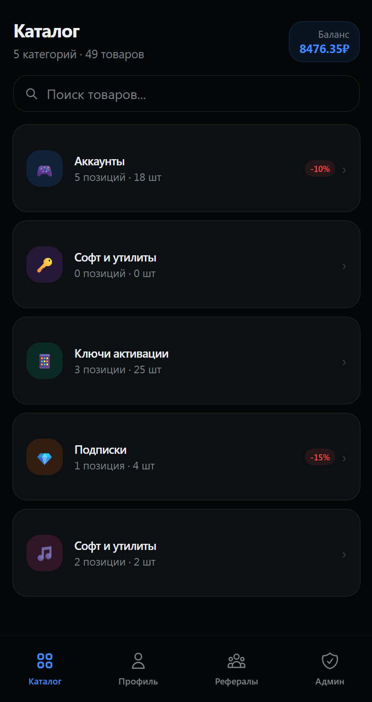</td>
<td width="33%" align="center"><b>Категория</b> 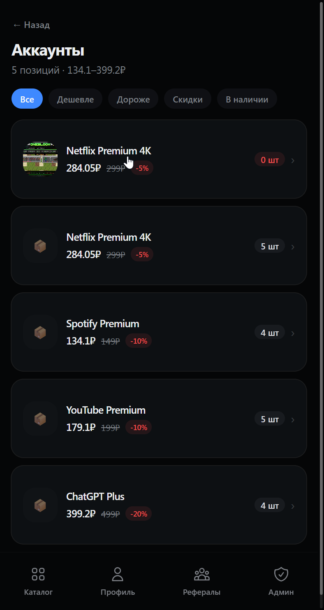</td>
<td width="33%" align="center"><b>Товар</b> 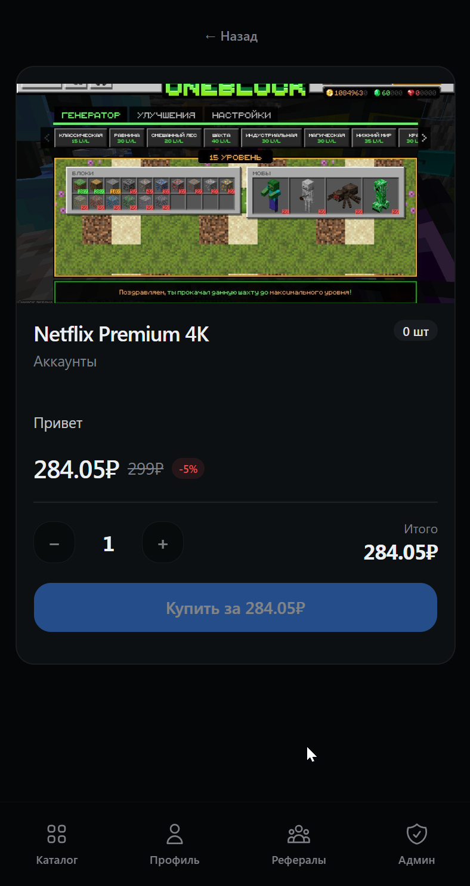</td>
</tr>
<tr>
<td align="center"><b>Профиль</b> 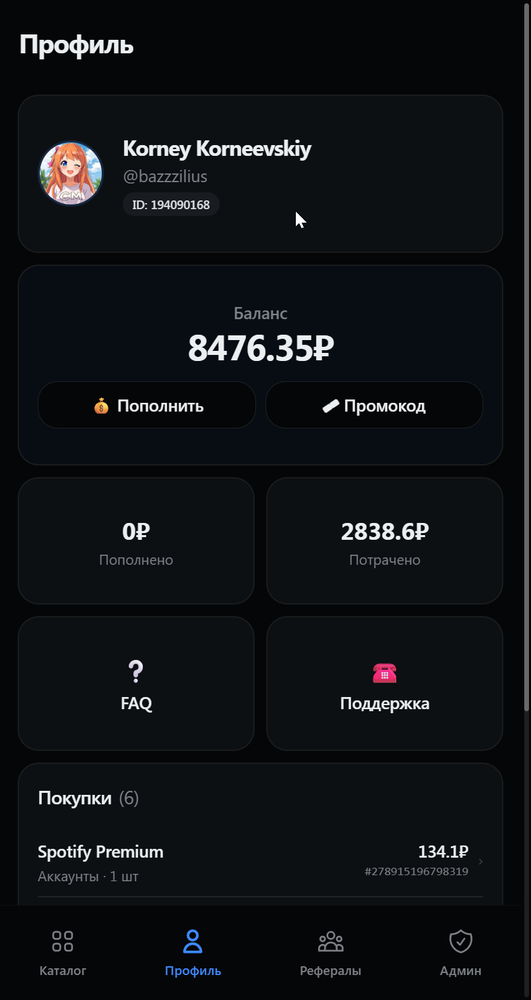</td>
<td align="center"><b>Детали покупки</b> 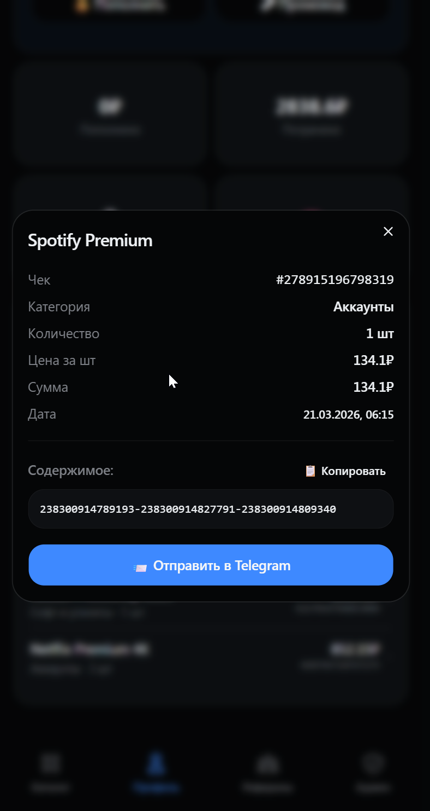</td>
<td align="center"><b>Рефералы</b> 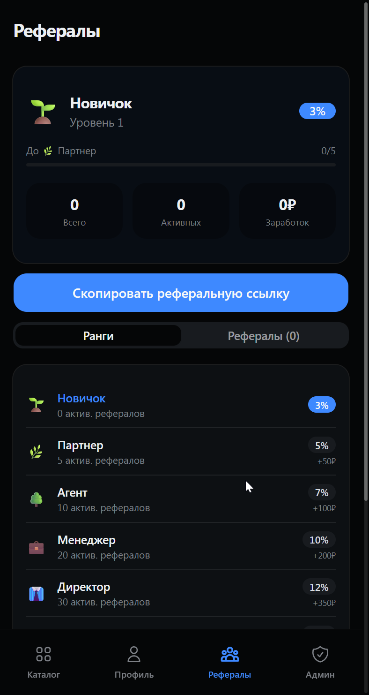</td>
</tr>
</tbody>
</table>

### Скриншоты админ-панели

<table>
<tbody>
<tr>
<td width="33%" align="center"><b>Статистика</b> 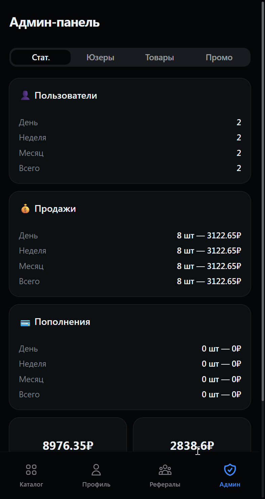</td>
<td width="33%" align="center"><b>Товары</b> 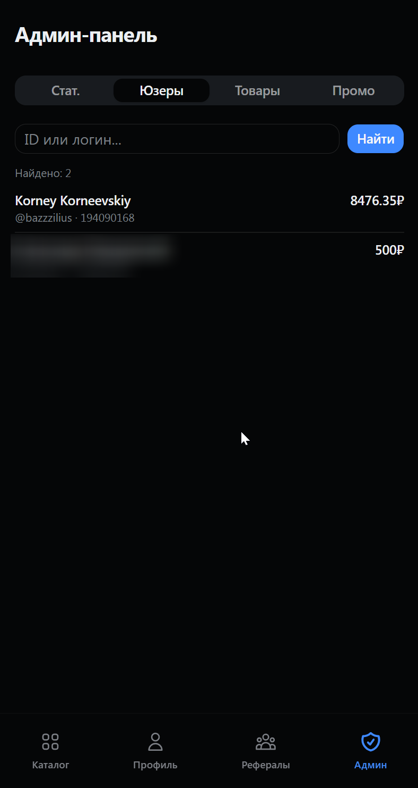</td>
<td width="33%" align="center"><b>Юзеры</b> 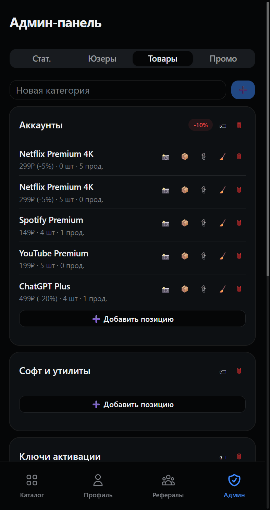</td>
</tr>
<tr>
<td align="center"><b>Промокоды</b> 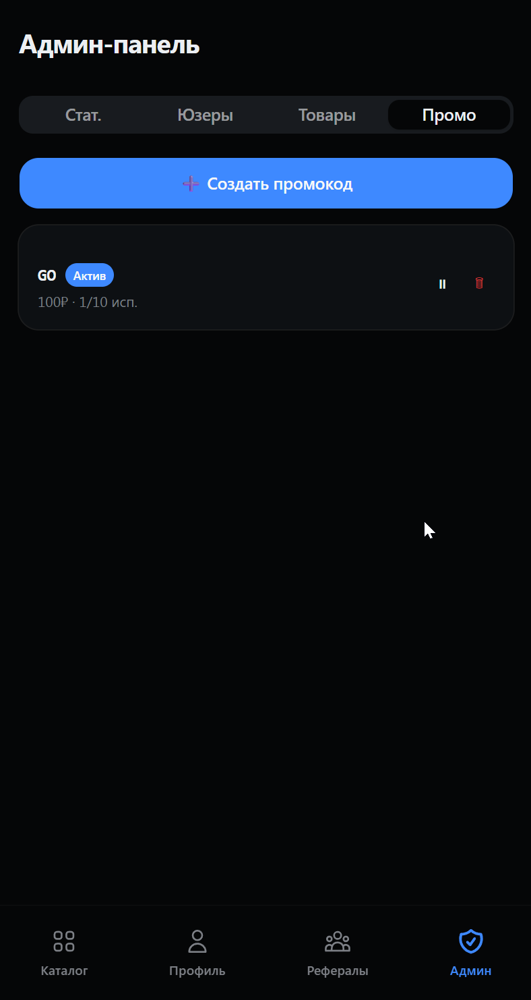</td>
<td align="center"><b>Создание промокода</b> 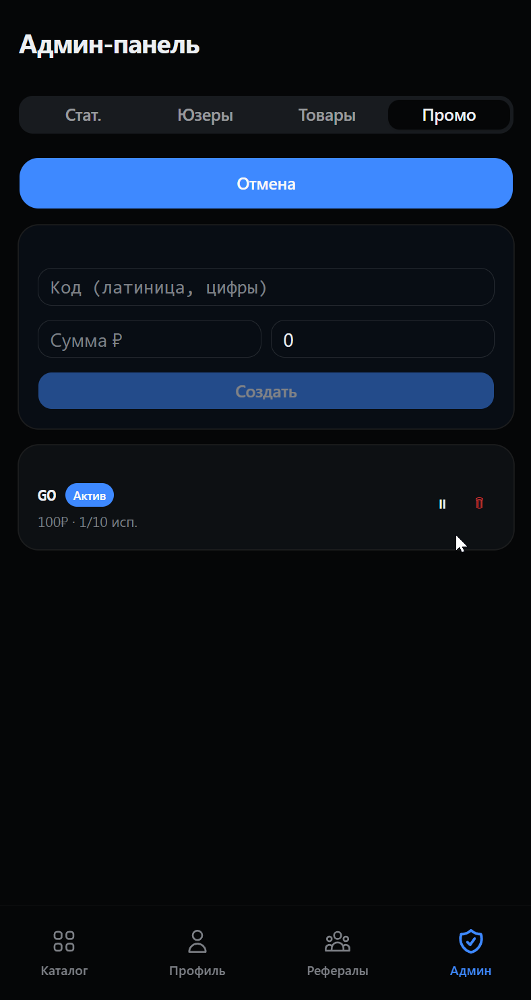</td>
<td align="center"><b>Редактирование</b> 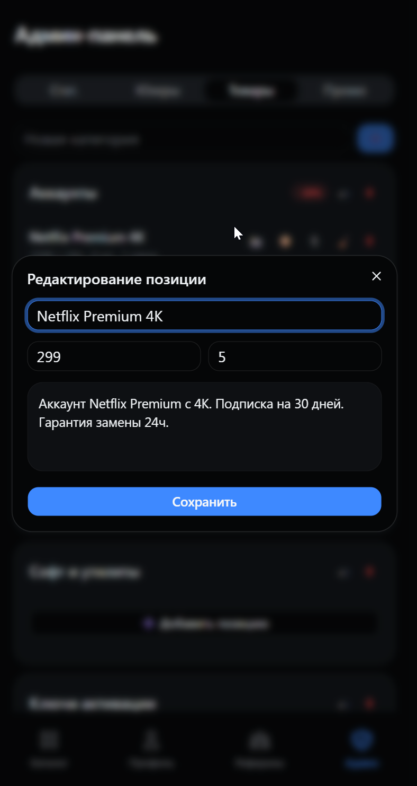</td>
</tr>
</tbody>
</table>

## Реферальная программа

| Ранг | Рефералов | Бонус | Награда |
|------|-----------|-------|---------|
| Новичок | 0 | 3% | — |
| Партнер | 5 | 5% | 50₽ |
| Агент | 10 | 7% | 100₽ |
| Менеджер | 20 | 10% | 200₽ |
| Директор | 30 | 12% | 350₽ |
| Эксперт | 50 | 15% | 500₽ |
| Мастер | 75 | 17% | 750₽ |
| Легенда | 100 | 19% | 1000₽ |
| Титан | 150 | 22% | 1500₽ |
| Магнат | 200 | 25% | 2500₽ |

Все уровни, проценты и награды настраиваются.

---

## СТОИМОСТЬ

| Пакет | Что входит | Цена |
|-------|-----------|------|
| **Стандарт** | Бот + 6 платёжек + рефералы + промокоды + скидки | **4 990₽** |
| **Премиум** | Стандарт + Web App витрина + админка в вебе + Docker + Nginx | **8 990₽** |
| **Под ключ** | Премиум + установка на ваш сервер + подключение домена + SSL + 30 дней поддержки | **14 990₽** |

> 💎 **Разовая оплата. Без подписок. Исходный код — ваш навсегда.**

---

## Контакты
Связаться: [BazZziliuS](https://t.me/BazZziliuS)
